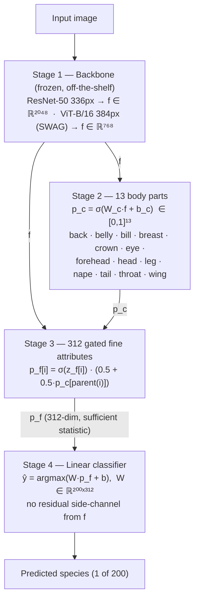
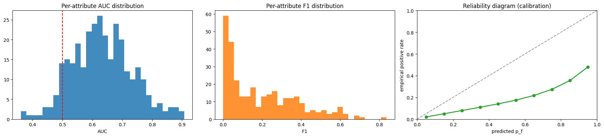
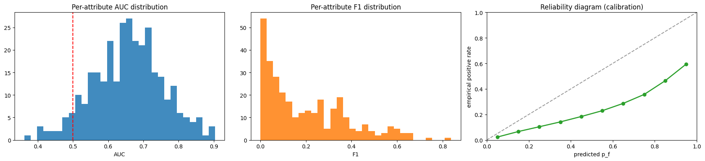
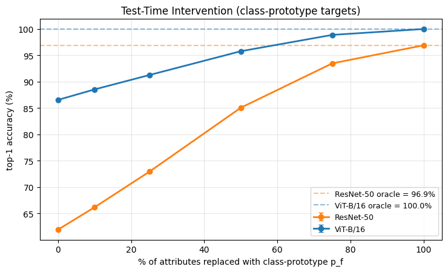
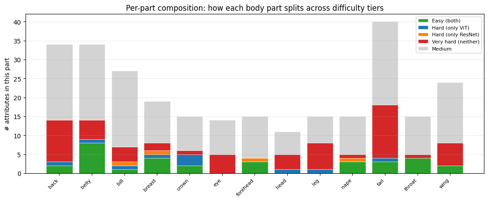
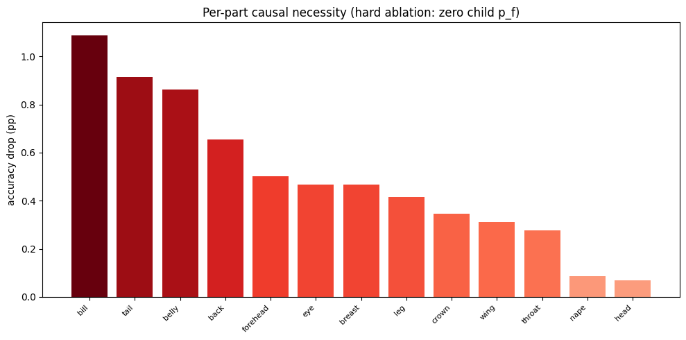

<div align="center">

# 🧠 Explainable and Trustworthy AI

### Hierarchical Concept Bottleneck Models for explainable-by-design fine-grained bird classification, on two parallel backbones (ResNet-50 vs. ViT-B/16)


</div>

<br>

> **TL;DR** — A standard image classifier `ŷ = argmax(W·f)` feeds a
> penultimate feature vector `f` straight into a softmax layer — `f` has
> no human meaning, so there's no way to read *why* a species was chosen.
> This project removes that opacity **at the architectural level**: `f` is
> routed through two extra layers that are themselves human-understandable
> concepts — **13 coarse body parts**, then **312 fine attributes**
> architecturally gated by their parent part — and the linear classifier
> is forced to consume **only those concepts**. Every prediction reduces
> to an explicit, rankable causal chain: no probing, no surrogate model,
> no post-hoc attribution — *the explanation is the decision*. The design
> is validated on **CUB-200-2011** across two independent backbones
> (ResNet-50 and ViT-B/16) to show the explanation pattern is a property
> of the bottleneck, not of whichever feature extractor sits under it.

<br>

## 📋 Contents

- [The Problem & How It's Handled](#-the-problem--how-its-handled)
- [Architecture — 4 Stages](#️-architecture--4-stages)
- [Two Independent Backbones](#-two-independent-backbones-not-a-pipeline)
- [Training](#-training)
- [Reading a Single Prediction](#-reading-a-single-prediction)
- [Are the Concepts Actually Learned?](#-are-the-concepts-actually-learned)
- [Are the Concepts Causally Necessary?](#-are-the-concepts-causally-necessary)
- [Conclusion](#-conclusion)
- [Dataset](#️-dataset)
- [Repository Structure](#-repository-structure)
- [Running It](#-running-it)
- [References](#-references)

<br>

## 🎯 The Problem & How It's Handled

<table>
<tr>
<td width="25%" valign="top"><b>🧩 Problem</b></td>
<td>A standard classifier's penultimate feature vector <code>f</code> has no human meaning — there's no way to read <i>why</i> a prediction was made, only post-hoc approximations (Grad-CAM, saliency) that explain a decision the model didn't actually reason about</td>
</tr>
<tr>
<td valign="top"><b>🔧 Solution</b></td>
<td>Interpose two <b>human-understandable concept layers</b> between the feature vector and the classifier, and make the classifier structurally incapable of seeing anything except those concepts — explainability enforced by architecture, not by a training-time penalty or a post-hoc tool</td>
</tr>
<tr>
<td valign="top"><b>📦 Data</b></td>
<td>CUB-200-2011 — 200 bird species, 312 built-in attribute annotations</td>
</tr>
<tr>
<td valign="top"><b>🔬 Validation strategy</b></td>
<td>Build the identical design <b>twice</b>, on two very different backbones (ResNet-50, ViT-B/16), and check whether the same concepts turn out easy/hard/necessary on both — if so, the explanation is a property of the bottleneck, not an artifact of one feature extractor</td>
</tr>
<tr>
<td valign="top"><b>✅ Result</b></td>
<td>Same easiest/hardest concepts, same causally-necessary body parts, on both backbones — the design generalizes</td>
</tr>
</table>

<br>

## 🏗️ Architecture — 4 Stages

A standard classifier is `ŷ = argmax(W·f)` — `f` goes straight from the
backbone into the softmax layer. This project instead routes `f` through
two added, human-readable layers before any classification happens, so the
resulting model `ŷ = argmax(W·p_f)` is exactly as explainable as the 312
concepts it consumes.



<table>
<tr><th align="left">Stage</th><th align="left">What it does</th></tr>
<tr><td><b>1 — Backbone</b></td><td>A frozen, off-the-shelf feature extractor. <code>f</code> is <i>not</i> the explanation — just the raw representation the next two layers translate into concepts.</td></tr>
<tr><td><b>2 — Coarse head (13 parts)</b></td><td><code>p_c = σ(W_c·f + b_c)</code> — reading <code>p_c</code> alone already answers "which body parts is the model looking at?"</td></tr>
<tr><td><b>3 — Gated fine head (312 attributes)</b></td><td>A second head projects <code>[f ; p_c]</code> to 312 raw logits, gated by their parent part (see below). The 34 global attributes with no part parent — e.g. <code>shape</code>, <code>size</code> — use mask <code>= 1</code>.</td></tr>
<tr><td><b>4 — Linear classifier</b></td><td><code>ŷ = argmax(W·p_f + b)</code>, <code>W ∈ ℝ²⁰⁰ˣ³¹²</code>. No residual path from <code>f</code> — the 312 gated concepts are a <b>sufficient statistic</b> for the prediction, full stop.</td></tr>
</table>

<details>
<summary><b>🔒 The parent gate — the core architectural guarantee</b></summary>
<br>

$$p_f[i] = \sigma(z_f[i]) \cdot \bigl(0.5 + 0.5\,p_c[\mathrm{parent}(i)]\bigr)$$

This single equation enforces the hierarchy **architecturally**, not as a
soft training-time penalty: a low parent probability damps every child
attribute toward a floor of `0.5` — never zero, so gradients survive — and
a high parent probability lets the child fire fully. The gate is
**identical at training and at inference**, so the classifier never sees
an out-of-distribution `p_f` at evaluation time that it wasn't trained to
handle. This is what separates the design from prior hierarchical CBMs,
where the coarse-to-fine consistency lives only in the loss and nothing
prevents a violation once the model is deployed.

</details>

<br>

## 🔀 Two Independent Backbones — not a pipeline

The identical H-CBM design is built **twice**, entirely independently, on
two very different feature extractors:

<table>
<tr><th align="left">Backbone</th><th align="left">Input</th><th align="left">Pretrained weights</th><th align="left"><code>f</code> dimension</th></tr>
<tr><td><b>ResNet-50</b></td><td>336×336</td><td>ImageNet-V2</td><td>2048-d</td></tr>
<tr><td><b>ViT-B/16</b></td><td>384×384</td><td>SWAG-E2E (3.6B Instagram images → fine-tuned on ImageNet)</td><td>768-d</td></tr>
</table>

Everything above the backbone — the 13-part head, the 312-attribute gated
head, the linear classifier — is architecturally identical between the two.
The point of running both is to answer one question: **does the backbone
choice change which concepts are easy, hard, or causally necessary?** If
the same pattern shows up independently on both, that pattern is a
property of the hierarchical bottleneck design itself, not an artifact of
one particular feature extractor — which is exactly what the results below
show.

<br>

## 📉 Training

The 13/312 hierarchy is parsed **deterministically** from the CUB
attribute names — no extra annotation is required. Part labels are the
OR-aggregation of their children (a part is "present" for an image if at
least one of its attributes is present in the ground truth).

Training runs in **three sequential phases**:

<table>
<tr><th align="left">Phase</th><th align="left">Trainable</th><th align="left">Loss</th><th align="left">Why</th></tr>
<tr><td><b>1</b></td><td>Both heads, backbone frozen</td><td><code>λ_c·L_coarse + λ_f·L_fine + 0.1·L_task</code> (weighted BCE / Focal Loss / label-smoothed CE)</td><td>Learn the concept space on frozen features; a small task term shapes concepts to already be discriminative</td></tr>
<tr><td><b>2</b></td><td>Linear classifier only</td><td><code>L_task</code> on the model's own <b>predicted</b> <code>p_f</code></td><td>The classifier must learn the actual (noisy) distribution of concepts it will see at evaluation — not a clean ground-truth distribution it will never encounter again</td></tr>
<tr><td><b>3</b></td><td>Everything, jointly</td><td>Concept-dominant weights (2/2/1) + MixUp <code>α=0.2</code></td><td>End-to-end refinement without letting the task loss drown out concept quality</td></tr>
</table>

> The backbone always trains at an order-of-magnitude lower learning rate
> than the heads; for ViT-SWAG that backbone rate is reduced further still,
> to avoid destroying its pretrained attention features.

<br>

## 🔎 Reading a Single Prediction

Because the classifier is a single linear layer over 312 concepts, every
prediction reduces to a fully explicit causal chain: the backbone produces
`f` → the coarse head turns `f` into `p_c` (which parts are visible) → the
fine head turns `f` and `p_c` into the gated `p_f` (which attributes are
present) → the predicted class is whichever row of `W` best aligns with
that `p_f`. To explain a specific prediction, rank the contributions
`W[ŷ, i] · p_f[i]` for `i = 1…312` and read off the top contributors.

<p align="center"></p>

> **No probing, no surrogate model, no post-hoc attribution — the
> explanation *is* the decision.**

<br>

## 📊 Are the Concepts Actually Learned?

The walkthrough above is only trustworthy if the 312 attribute detectors
are themselves accurate. Per-attribute AUC against CUB ground-truth labels
answers that, on the held-out test split, for **both** backbones
independently:

<p align="center">


</p>

- **Best-detected attributes (both backbones):** visually obvious yellow
  body-part colors — salient *and* well represented in CUB — reaching
  **AUC ≥ 0.87**.
- **Worst-detected attributes (both backbones):** rare colors
  (`pink`/`purple` body parts, `rufous`) and unusual shapes (`owl-like`,
  `very_large`), sitting in the **0.36–0.49** band — barely above chance.
- **The take-away is direct and actionable:** a prediction whose top
  contributors are yellow body colors is well-supported by the bottleneck;
  one that hinges on a rare color or shape attribute should be read with
  caution.
- Critically, **the same set of easiest and hardest concepts is recovered
  independently by two completely different backbones** — the explanation
  pattern is a property of the hierarchical design, not of the feature
  extractor bolted underneath it.

<details>
<summary><b>📈 Concept controllability — Test-Time Intervention</b></summary>
<br>

<p align="center"></p>

Faithfulness of the bottleneck can be tested directly: replace a fraction
`r` of the 312 predicted concept probabilities with ground-truth values,
then re-run the (frozen) linear classifier. At `r = 0%` we recover the
normal baseline; as `r` grows toward `100%`, accuracy climbs
**monotonically** toward the oracle — with no hidden residual
side-channel, fixing more concepts always helps.

<table>
<tr><th align="left">Backbone</th><th align="left">Baseline accuracy (r=0%)</th><th align="left">Oracle accuracy (r=100%)</th></tr>
<tr><td><b>ResNet-50</b></td><td>61.9%</td><td>96.9%</td></tr>
<tr><td><b>ViT-B/16</b></td><td>86.6%</td><td>100.0%</td></tr>
</table>

Both curves confirm the linear classifier genuinely *uses* the concept
layer rather than ignoring it — the core sanity check for any CBM.
ViT-B/16's much higher baseline and perfect oracle ceiling show it builds
a substantially richer concept representation than ResNet-50 on the same
task, on top of the identical bottleneck design.

</details>

<details>
<summary><b>🧩 Difficulty distribution across body parts</b></summary>
<br>

<p align="center"></p>

Splitting the 312 attributes into difficulty tiers (Easy: AUC ≥ 0.75 on
**both** backbones; Very-hard: neither) and grouping by body part shows
`tail` has the most Very-hard attributes (`n = 14`) — yet, as the next
section shows, `tail` is also one of the most *causally necessary* parts.
That combination — hard to detect individually, but heavily relied upon —
is a clear direction for future work.

</details>

<br>

## 🎯 Are the Concepts Causally Necessary?

A faithful explanation shouldn't just list concepts that *correlate* with
the prediction — it should pinpoint the concepts the model genuinely
*needs*. This is tested by zeroing the `p_f` columns of one body part at a
time across the whole test split, re-running the linear classifier, and
recording the accuracy drop. Because the classifier consumes `p_f`
directly (no side-channel), this is a clean causal counterfactual: *"what
would the model do if it could not see this body part at all?"*

<p align="center">


</p>

- **On ResNet-50:** the three body parts the model relies on most heavily
  are `bill`, `tail`, and `belly` — zeroing `bill` alone drops accuracy by
  **1.4 pp**, and the top three together account for more than half of the
  total ablation budget. The tail of the ranking (`crown`, `forehead`,
  `nape`) contributes under 0.2 pp each.
- **On ViT-B/16:** the same ablation recovers **the same three parts in
  the same order**, with very similar magnitudes.
- **The "which parts matter" signal is a property of the H-CBM design
  itself, not of the backbone** — exactly the generalization the
  dual-backbone setup was built to test.

<br>

## ✅ Conclusion

Inserting two human-understandable concept layers — 13 body parts and 312
gated fine attributes — between any image backbone and the final linear
classifier turns every prediction into a readable causal chain. Running
the identical design on two very different feature extractors
(ResNet-50 and ViT-B/16) shows the explanation surfaces **the same way on
both**: the same yellow body colors come out as the easiest concepts, the
same rare colors and shapes come out as the hardest, and the same three
body parts (`bill`, `tail`, `belly`) come out as causally necessary. The
H-CBM bottleneck is therefore an **explainability layer that sits on top
of any backbone**, not a property of one particular architecture.

<br>

## 🗃️ Dataset

**CUB-200-2011** — 11,788 images, 200 bird species.

<table>
<tr><th align="left">Split</th><th align="left">Size</th></tr>
<tr><td>Train</td><td>~5,394</td></tr>
<tr><td>Val</td><td>~600 (10% stratified hold-out from train, <code>random_state=42</code>)</td></tr>
<tr><td>Test</td><td>5,794</td></tr>
</table>

- **13 coarse parts** — `back, belly, bill, breast, crown, eye, forehead,
  head, leg, nape, tail, throat, wing` — parsed automatically from the
  prefix of `attributes.txt`.
- **312 fine attributes** — the standard CUB attributes, kept only when
  `certainty ≥ 3`; 34 global attributes with no part parent (e.g.
  `shape`, `size`) use mask `= 1`.

<details>
<summary><b>Expected data layout</b></summary>
<br>

```
MyDrive/XAI-Project/DB/DB1/
├── CUB_200_2011/         ← images + the official txt files
├── attributes.txt
├── checkpoints/          ← best_model.pth, best_hcbm_vit_384.pth, …
└── pipeline/             ← data_pipeline_resnet.pkl, data_pipeline_vit.pkl, train history
```

Downloads: [CUB-200-2011 (1.2 GB)](https://data.caltech.edu/records/65de6-vp158) ·
[Segmentation masks (39 MB, optional)](https://data.caltech.edu/records/w9d68-gec53)

</details>

<br>

## 📁 Repository Structure

```
.
├── 01_data.ipynb                                    # Shared data prep, used by both branches
├── 02_H-CBM ResNet-50_train.ipynb                    # Trains the ResNet-50 H-CBM
├── 02_H-CBM ResNet-50_explainability.ipynb           # Full explanation suite for the ResNet-50 model
├── 03_H-CBM ViT-B16_train.ipynb                      # Trains the ViT-B/16 H-CBM
├── 03_H-CBM ViT-B16_explainability.ipynb             # Full explanation suite for the ViT-B/16 model
├── 04_H-CBM Comparison ResNet-50 vs ViT-B16.ipynb    # Head-to-head comparison notebook
├── src/                                               # Shared utility modules
├── figures/                                           # Report figures (AUC, TTI, causal-necessity plots)
└── README.md
```

> The two branches are **independent** — run only branch A or only branch
> B, and that branch's explainability notebook works on its own. Notebook
> `04` needs both checkpoints on disk.

<br>

## 🚀 Running It

```bash
git clone https://github.com/Sina-Ghiabi/Explainable-And-Trustworthy-AI.git
cd Explainable-And-Trustworthy-AI

python -m venv .venv
.venv\Scripts\activate              # Windows
# source .venv/bin/activate         # Linux / macOS

pip install torch torchvision pillow matplotlib numpy scikit-learn pandas
```

The training notebooks are written for **Google Colab with an A100/H100**
(BF16 AMP, `torch.compile`, large batch). The explainability and
comparison notebooks are light and run on any GPU (or CPU, slowly). The
Colab-only cells (`drive.mount`) sit at the top of each notebook and are
easy to skip when running locally.

<br>

## 📚 References

<table>
<tr><td>[1]</td><td>Koh, P.W. et al. — <i>Concept Bottleneck Models</i> — ICML 2020</td></tr>
<tr><td>[2]</td><td>Pittino, F. et al. — <i>Hierarchical CBM for Vision</i> — EAAI 2023</td></tr>
<tr><td>[3]</td><td>Poeta, E. et al. — <i>Concept-based XAI: A Survey</i> — ACM CSUR 2025</td></tr>
<tr><td>[4]</td><td>Lin, T.Y. et al. — <i>Focal Loss for Dense Object Detection</i> — ICCV 2017</td></tr>
<tr><td>[5]</td><td>Kendall, A. et al. — <i>Multi-Task Learning Using Uncertainty to Weigh Losses</i> — CVPR 2018</td></tr>
<tr><td>[6]</td><td><i>P1 — Hierarchical Concept-Based Explainable-by-Design Models</i> — XAI Course brief, PoliTo, 2025/2026</td></tr>
</table>

<br>

## 🛠️ Tech Stack


<br>

---

<div align="center">
<sub>Explainable and Trustworthy AI — Politecnico di Torino, A.Y. 2025/2026 · Project P1, Hierarchical Concept-Based Explainable-by-Design Models.</sub>
</div>
